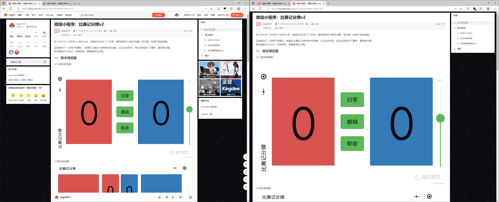

平时在浏览网站的时候，想更专注文章内容，所以开发了一些常用网页的净化脚本。

完美页面阅读体验，去除广告、推荐等一系列和阅读无关的内容。

一、目前支持

CSDN、掘金、简书、博客园、知乎专栏、知乎问题、V2EX、百度贴吧、百度经验、百度百科、百度知道等页面。

二、插件发布地址

Greasyfork：[极致净化页面合集](https://greasyfork.org/zh-CN/scripts/527915-%E6%9E%81%E8%87%B4%E5%87%80%E5%8C%96%E9%A1%B5%E9%9D%A2%E5%90%88%E9%9B%86)

三、问题反馈

因为网站内容是丰富且变动的，所以遗漏在所难免，若未及时更新，请在 [Github Issue](https://github.com/evgo2017/purify-page/issues) 或在 [Greasyfork Feedback](https://greasyfork.org/zh-CN/scripts/527915-%E6%9E%81%E8%87%B4%E5%87%80%E5%8C%96%E9%A1%B5%E9%9D%A2%E5%90%88%E9%9B%86/feedback) 进行反馈（具体的网页 url、截图等）。
